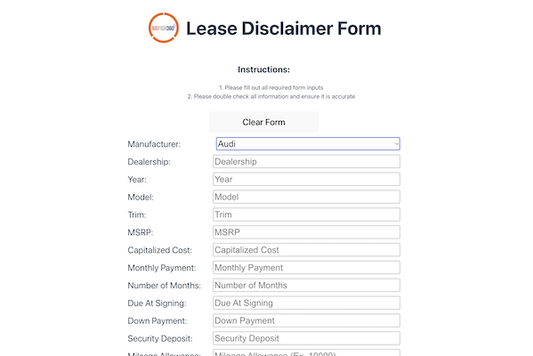

# Lease Disclaimer App

The Lease Disclaimer App was built to make automotive marketing/graphic design processes more streamlined and accurate. Users can input auto lease information to generate copy and disclaimers that are used for advertisements rather than having to generate them on the fly or copy, paste, and edit old copy.

This app is currently being used internally by BigFish360, but in the future there is opportunity to add backend functionality and have the automotive clients fill out the form to send the advertisement copy directly to the graphic designers.

  

## Technologies Used

    <li style="margin: auto">
        
        React
    </li>
      <li>
        
        CSS
    </li>

## Live App

View live app [here](https://bf360-lease.netlify.app/).
